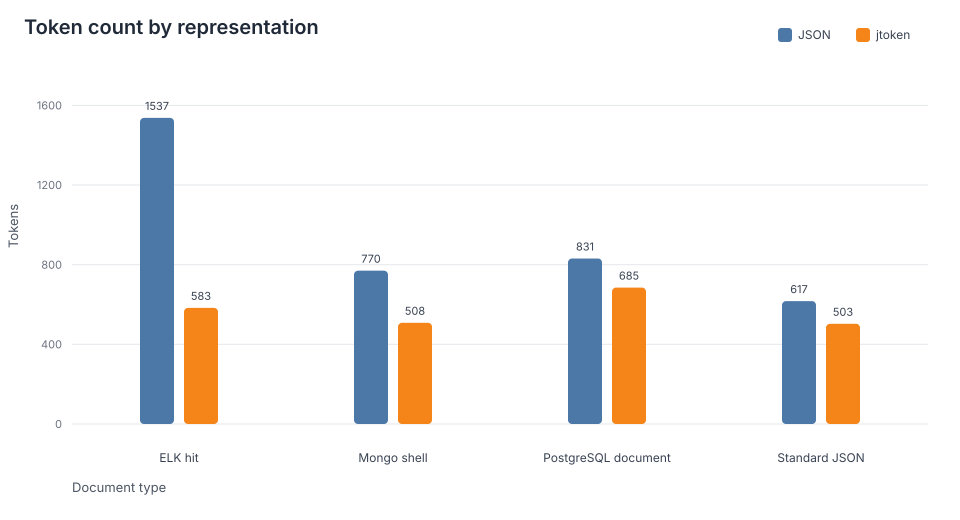

# jtoken

Compress JSON for LLM prompts — same data, fewer tokens.

**Author:** Hermann Samimi

jtoken strips JSON syntactic noise, collapses repeated booleans and nulls into summary lines, flattens nested dicts with dot notation, and supports normalization for Elasticsearch hits and MongoDB JSON. The package ships as a stdlib-first library with an optional `tiktoken` extra and a `jtoken` CLI.

## Installation

### Core

```bash
pip install jtoken
```

No extra runtime dependencies.

### With tokenizer-accurate counting

```bash
pip install "jtoken[tiktoken]"
```

Use the `tiktoken` extra when you want OpenAI-compatible token counts instead of the built-in estimate backend.

## Quick start

```python
import jtoken

data = {
    "user": "alice",
    "age": 30,
    "premium": True,
    "verified": True,
    "is_remote": False,
    "trial": False,
    "score": 9.5,
    "referral": None,
    "last_login": None,
}

text = jtoken.encode(data)
original = jtoken.decode(text)
assert original == data
```

`dumps` / `loads` are json-style aliases for `encode` / `decode`.

## What the format looks like

**JSON**

```json
{"name": "Alice", "age": 30, "active": true, "verified": false, "ref": null}
```

**jtoken**

```text
name: Alice
age: 30
trues: active
falses: verified
nulls: ref
```

Nested dicts flatten with dot notation. Booleans and nulls at any depth collapse into the same summary lines. Decode reconstructs the original nested structure.

## Normalization and denormalization

Foreign document shapes can be normalized before encoding and restored after decode with a sidecar context.

```python
import jtoken

raw_hit = {...}
normalized, context = jtoken.normalize(raw_hit, source="elastic_hit")
text = jtoken.encode(normalized)
restored = jtoken.denormalize(
    jtoken.decode(text),
    target="elastic_hit",
    context=context,
)
```

```bash
jtoken encode --input-format elastic_hit -f hit.json --context-out hit.ctx.json
jtoken decode --output-format mongo_shell -f hit.jtoken --context-in hit.ctx.json
```

Supported input dialects: `auto`, `json`, `python`, `mongo_extended`, `mongo_shell`, `elastic_hit`, `elastic_source`.

Supported output dialects: `python`, `json`, `mongo_extended`, `mongo_shell`, `elastic_hit`, `elastic_source`.

## CLI

```bash
echo '{"name": "Alice", "active": true}' | jtoken encode
echo 'name: Alice\ntrues: active' | jtoken decode
echo '{"name": "Alice", "active": true}' | jtoken stats
echo '{"name": "Alice", "active": true}' | jtoken count
```

Use `-f/--file` for file input. `encode`, `stats`, and `count` accept `--input-format`. `decode` accepts `--output-format` and `--context-in` when restoring non-JSON dialects. `stats` and `count` accept `--model` and `--backend`.

## Token savings

```python
import jtoken

stats = jtoken.token_savings(data, model="gpt-4o", backend="tiktoken", json_indent=2)
print(stats)
# jtoken: 22 tokens | json: 36 tokens | saved: 14 (38.9%)

print(stats.jtoken_tokens, stats.json_tokens, stats.saved, stats.percent)
```

`count_tokens` and `count_text_tokens` are also available. Savings compare the jtoken representation against pretty JSON by default (`json_indent=2`).

### Representative token counts

Sample payloads measured as pretty JSON versus jtoken on representative documents:

| Document type | JSON | jtoken |
|---|---:|---:|
| ELK hit | 1537 | 583 |
| Mongo shell | 770 | 508 |
| PostgreSQL structured document | 831 | 685 |
| Standard JSON | 617 | 503 |



## API reference

### Package metadata

- `jtoken.__version__`
- `jtoken.__author__`

### Core codec

- `encode(data: dict) -> str`
- `decode(text: str) -> dict`
- `dumps` / `loads`

### Normalization

- `parse_input(text, *, source="auto")`
- `normalize(data, *, source="auto", context=None) -> tuple[dict, NormalizationContext]`
- `denormalize(data, *, target="python", context)`
- `render_output(value, *, target="python") -> str`
- `encode_document(raw, *, source="auto", context=None) -> tuple[str, NormalizationContext]`
- `decode_document(text, *, target="python", context)`

### Token helpers

- `count_tokens(data, *, model="cl100k_base", backend="auto") -> int`
- `count_text_tokens(text, *, model="cl100k_base", backend="auto") -> int`
- `token_savings(data, *, model="cl100k_base", backend="auto", json_indent=2) -> TokenSavings`

### `TokenSavings`

- `jtoken_tokens`
- `json_tokens`
- `saved`
- `percent`

### `NormalizationContext`

- `source_format`
- `target_format`
- `typed_values`
- `lists`
- `dotted_keys`
- `elastic`
- `to_dict()` / `from_dict()`

### Format enums

- `InputFormat`
- `OutputFormat`

### Exceptions

- `JPackError`
- `JPackEncodeError`
- `JPackDecodeError`
- `NormalizationError`
- `DenormalizationError`
- `TokenCountError`

## Development

```bash
git clone https://github.com/hermannsamimi/jtoken
cd jtoken
pip install -e ".[dev]"
pytest
pytest --cov=jtoken --cov-report=term-missing
```

## License

MIT — © 2026 Hermann Samimi
